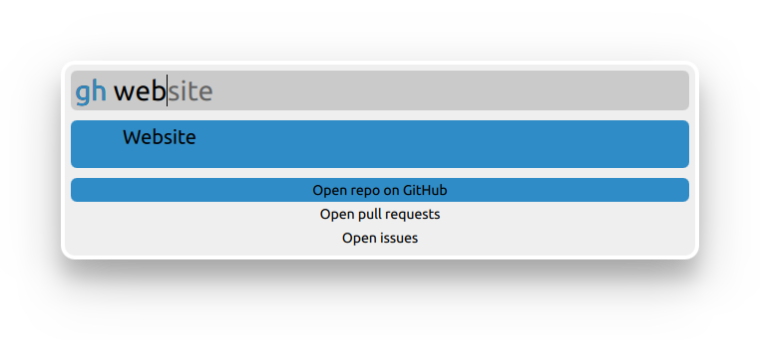

Access your GitHub repos quickly through Albert.

This plugin caches all repos for a list of accounts (configured via the 
plugin settings). 

It then allows opening the repo home page, PRs or issues.

